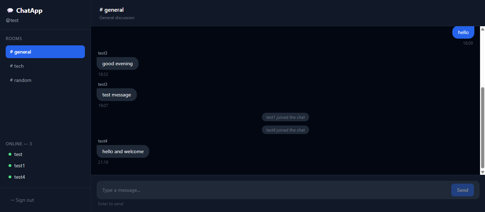
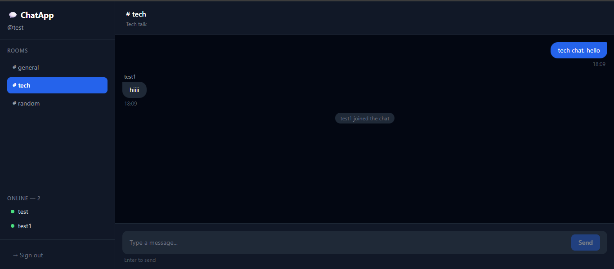

# ChatApp — Client

A real-time chat application frontend built with React, Tailwind CSS, and Socket.io. Features JWT-based authentication, multiple chat rooms, live online user tracking, and persistent message history.

---

## Screenshots

### Chat (General Room)


### Chat (Tech Room)


---

## Features

- 🔐 User registration and login with JWT authentication
- 💬 Real-time messaging powered by Socket.io
- 🏠 Multiple chat rooms (General, Tech, Random)
- 🟢 Live online users list per room
- 📜 Message history loaded on room join
- 🔔 Join and leave notifications
- 📱 Responsive dark UI built with Tailwind CSS
- 🔒 Protected routes — redirects to login if unauthenticated

---

## Tech Stack

| Layer | Technology |
|-------|-----------|
| Framework | React 18 (Vite) |
| Styling | Tailwind CSS v3 |
| Real-time | Socket.io Client |
| HTTP Requests | Axios |
| Routing | React Router DOM v6 |
| Auth | JWT (stored in localStorage) |

---

## Getting Started

### Prerequisites

- Node.js v18+
- The [chat-app-server](https://github.com/singhkailash9/chat-app-server) running locally on port 5000

## Installation


1) Clone the repository
```
git clone https://github.com/singhkailash9/chat-app-client.git
cd chat-app-client
```
2) Install dependencies
```
npm install
```
3) Start the development server
```
npm run dev
```

Open [http://localhost:5173](http://localhost:5173) in your browser.

---

## Project Structure

```
src/
├── components/
│   ├── MessageInput.jsx   # Message input bar with Enter to send
│   ├── MessageList.jsx    # Renders messages with sender alignment
│   └── UserList.jsx       # Online users sidebar with green dots
├── context/
│   └── AuthContext.jsx    # Global auth state (user, token, login, logout)
├── pages/
│   ├── Login.jsx          # Register / Login page
│   └── Chat.jsx           # Main chat page
├── socket.js              # Socket.io client instance (manual connect)
├── App.jsx                # Routes + protected route logic
└── main.jsx               # App entry point
```


## Related

- **Backend repo:** [chat-app-server](https://github.com/singhkailash9/chat-app-server)

---

## Author

**Kailash Singh** — [GitHub](https://github.com/singhkailash9) · [LinkedIn](https://www.linkedin.com/in/kailash-singh-725a10232/)